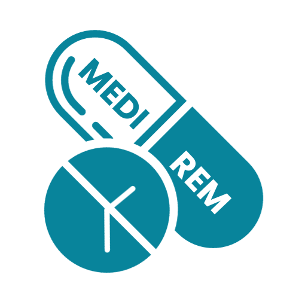

<p align="center">
    
</p>
# MediRem
The MediCare Reminder App is designed to address this issue by assisting individuals in managing their health effectively. It serves as a tool to keep track of medications, health check-ups, and lab test reports, ensuring that users never miss crucial health-related activities.
## ✨ Features
- Medication Reminders: Set reminders for medications with specific details.
- Health Check-up Alerts: Receive timely alerts for scheduled health check-ups.
- Lab Test Report Notifications: Stay informed about upcoming lab test reports.
- User-friendly Interface: Intuitive design for a seamless user experience.


## 🤔 Installation
1. Clone the repository:
   ```bash
   git clone https://github.com/Pree46/MediRem.git
   cd MediRem
   ```
   
2. Open the project in Android Studio or run the Kivy app using Python.

3. Ensure necessary permissions for reminders and notifications on your Android device.

## ✅ How MediRem Works
- Login or create an account.
- Navigate through medication reminders, health check-ups, or lab test notifications.
- Set reminders with specific details for a personalized experience.


## ▶️ Technologies used
- Development Platform: Android Studio(Java)
- Databae: SQLite Database
- Hardware: Android device with version 12 or higher


<br>


## 📞 Contact Us
If you have any questions or feedback about MediRem, please don't hesitate to contact us - 
<br>

<a href="https://www.linkedin.com/in/r-preethi-09254724b/"> R Preethi </a> <br>
<a href="https://www.linkedin.com/in/ritul-bharati-59683224b"> Ritul Bharati </a> <br>
